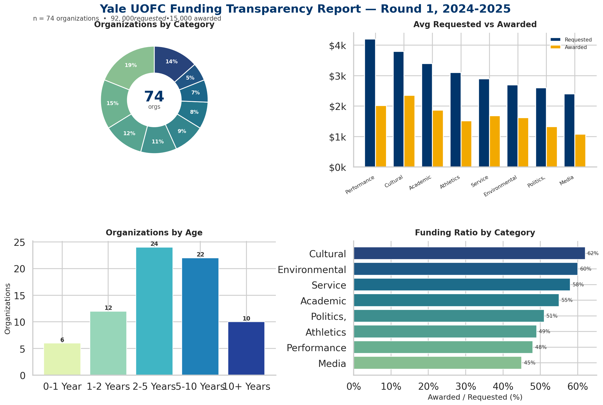
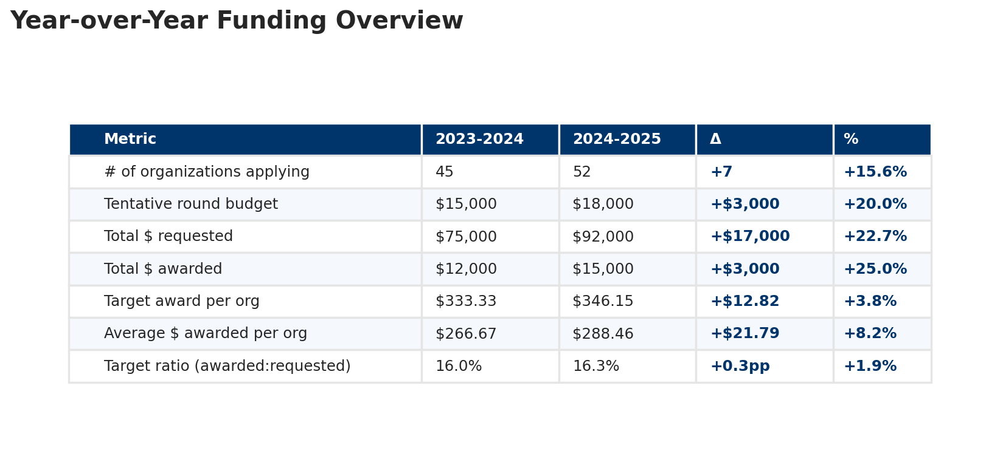

# UOFC Funding Transparency Report Generator

[](https://www.python.org/downloads/)
[](https://opensource.org/licenses/MIT)
[](https://github.com/astral-sh/ruff)

Config-driven pipeline that turns Yale's Undergraduate Organizations Funding Committee (UOFC) decision spreadsheets into a branded PowerPoint transparency report. One YAML schema retargets the whole pipeline to other institutions.



## Highlights

- Led a team of 3 software engineers to ship an end-to-end automation system for committee funding decisions
- The full system — quantitative intake pipeline plus this reporting layer — replaces over 80% of work-hours that 20+ analysts previously spent across allocation review, decision support, and public reporting
- This public repo is the reporting layer: one normalized funding workbook in → branded transparency deck out
- 33 tests, 0 lint findings, clean separation across loader / analyzer / charts / slides

## What it does

This repo is the public-facing reporting layer of a broader funding-automation workflow. An internal analytics pipeline (not open-sourced) does the upstream quantitative work — committee intake normalization, allocation analysis, exception flagging — and emits a structured Excel workbook of decisions. This tool consumes that workbook and produces the branded transparency report distributed to the student body. Together, the two halves replace over 80% of the analyst hours previously spent on each funding round.

On the reporting side specifically, this tool collapses what was a multi-day manual deck-build into one command: load the workbook, validate against a configurable schema, compute category / age-group / Dwight-Hall breakdowns, and emit a `.pptx` deck plus per-chart PNGs and CSVs. A single YAML config drives branding, sheet name patterns, and column aliases (20+ canonical columns × multiple acceptable header strings each). The CLI exposes a `validate` subcommand for dry-run schema checks. Optional Google Sheets integration pulls linked expense data; absent credentials, a deterministic mock keeps the full pipeline runnable for demos and CI.

Year-over-year overview is rendered directly into the deck — same generator drives the table image, the per-chart PNGs, and the slide composition:



## Technical notes

- **Severity-tiered validation, partial reports.** The loader returns `ValidationWarning(severity="error" | "warning", ...)`. Required-column misses halt the run; optional-column misses just skip the related visualization. Committee sheets drop optional columns between rounds — a partial deck beats a hard failure.
- **Column-alias resolver as the single source of truth.** Analyzer and chart code reference canonical names (`organization_name`, `amount_requested`). The resolver (`Config.resolve_column`) matches them against real Excel headers via case-insensitive exact match first, then prefix match — so a verbose header like `"Is your organization a Dwight Hall group? (member or provisional, but not outreach group)"` still resolves to `dwight_hall`.
- **Three-state Google Sheets client.** Live API when credentials are present; deterministic seeded mock when they're not; degraded mode with explicit warning when a request fails. The mock is a real implementation, not a stub — full pipeline runs end-to-end with zero external dependencies.
- **Defensive analytics over pretty analytics.** Every analysis section is guarded by a column-existence check. Divide-by-zero protection on the funding ratio. Currency / percentage / integer formatters tolerate non-numeric cells (the overview-table renderer walks every value and must not crash on `"N/A"`).
- **One chart = one file.** `charts/bar_charts.py`, `charts/pie_charts.py`, `charts/tables.py` are independent subclasses of `BaseChart`. Slide layout coordinates live in `slides/layouts.py` as typed constants — retargeting the deck to a different brand template is a layouts-module swap.

See [`ARCHITECTURE.md`](ARCHITECTURE.md) for the full pipeline diagram and design rationale.

## Stack

Python 3.10+ · pandas · openpyxl · matplotlib · seaborn · python-pptx · pydantic · click · rich · pyyaml · Pillow · (optional) google-api-python-client

## Run it

```bash
git clone https://github.com/iantinney/yale-uofc-data-analysis-project-public.git
cd yale-uofc-data-analysis-project-public
pip install -e .

uofc-report ExampleFundingSheet.xlsx 1
# → transparency_report_round1.pptx
```

Schema dry-run, no output written:

```bash
uofc-report validate ExampleFundingSheet.xlsx
```

Useful flags: `--verbose` (full per-step logging), `--show-mapping` (print which Excel headers were matched to which canonical columns), `--config my_config.yaml` (override branding / aliases / sheet patterns), `--output round2_report.pptx`.

## Excel file format

The generator expects a sheet named `Round {N} Decision for Analysis` per round, plus an optional `Overview` sheet for year-over-year metrics. Required columns (with example aliases the resolver accepts):

| Canonical name | Accepted headers (examples) | Required |
|---|---|---|
| `organization_name` | "Organization Name", "Org Name", "Name" | ✓ |
| `organization_category` | "Organization Category", "Category", "Type" | ✓ |
| `amount_requested` | "Amount Requested", "Requested", "Funding Requested" | ✓ |
| `amount_awarded` | "Amount Awarded", "Awarded", "Allocation" | ✓ |
| `organization_age` | "Organization Age", "Years Active" | optional |
| `active_members` | "Number of Active Members", "Members" | optional |
| `dwight_hall` | "Dwight Hall Group?", verbose question-form variants | optional |
| `other_funding` | "Other Funding Sources", … | optional |

Full alias table in `config/default.yaml`.

## Retargeting to another institution

Three files to touch:

1. `config/your_school.yaml` — branding (organization name, colors, URL, logo), `sheets.round_decision_pattern`, any institution-specific column aliases.
2. `src/uofc_funding/charts/` — add a new chart class only if pie / bar / table don't cover what you need.
3. `src/uofc_funding/slides/layouts.py` — adjust slide coordinates only if you're shipping a different brand template / aspect ratio.

Pass the new config with `--config`. Example:

```yaml
# my_school.yaml
branding:
  organization_name: "Stanford Student Organizations Funding"
  short_name: "SSOF"
  primary_color: "#8C1515"
sheets:
  round_decision_pattern: "Funding Cycle {round_number}"
column_aliases:
  organization_name: ["Organization", "Student Group", "RSO Name"]
```

## Google Sheets integration (optional)

Production runs at Yale pull expense data from linked Google Sheets; the public repo ships with the integration disabled. To enable:

```bash
pip install -e ".[google]"
```

1. Create a Google Cloud project, enable Sheets API + Drive API
2. Create OAuth 2.0 (Desktop) credentials, download as `credentials.json`
3. In your config: `google_api.enabled: true`
4. First run prompts a browser auth flow; token is cached as `token.json`

Without credentials, the integration falls back to deterministic mock data so demos and CI still produce a complete deck.

## Development

```bash
pip install -e ".[dev]"

pytest                    # 33 tests
ruff check src/ tests/
ruff format src/ tests/
mypy src/
```

## Output

Per run, the generator writes:

- `transparency_report_round{N}.pptx` — branded slide deck (title, overview/rubric, category distribution, average funding by category, age-group analysis, Dwight Hall comparison, other-funding analysis, top organizations)
- `funding_graphs/*.png` — chart images
- `funding_graphs/*.csv` — table data exports

Sample outputs are in [`examples/sample_output/`](examples/sample_output/).

## License

MIT — see [LICENSE](LICENSE).
